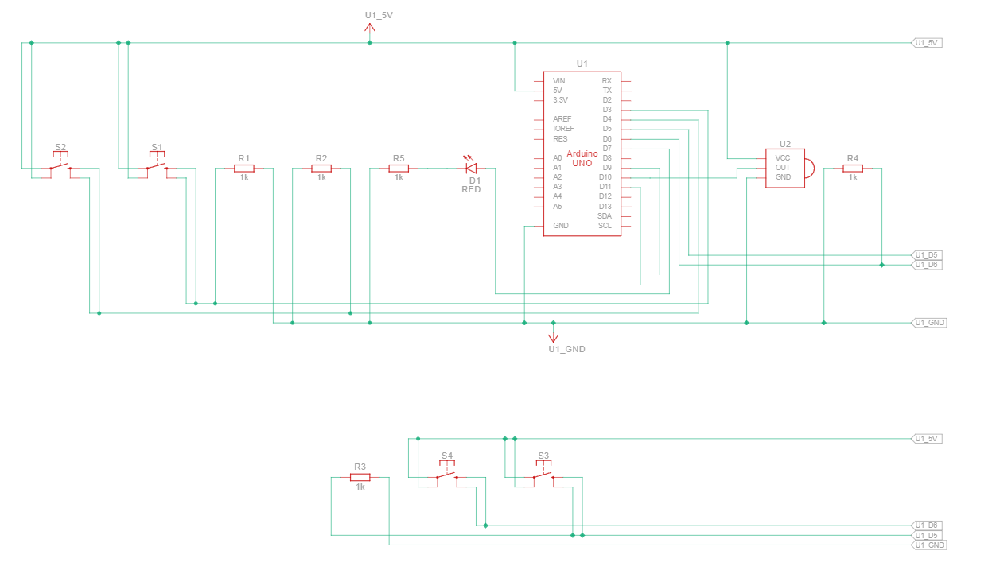
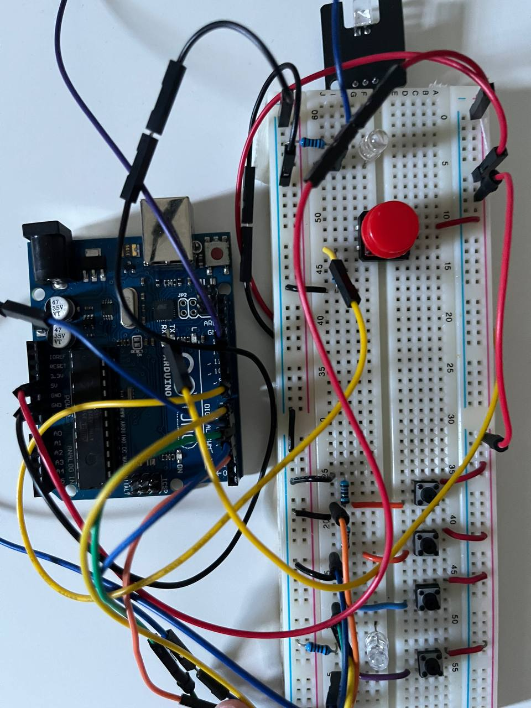

# samsungRemote

## Purpose

This repo was created for SOR (School of Robotics) specifically for the Arduino IR remote lesson.

### Implementation

The IR (Infrared) pronto hex formats are commonly used for transmission of IR signals to different devices from various manufacturers. 

These hex formats provide a standardized way to represent infrared remote control signals, ensuring compatibility between devices regardless of their brand or model. The Pronto hex format, in particular, is widely adopted in the consumer electronics industry for remote control programming.

In addition to its prevalence, the Pronto hex format is known for its simplicity and ease of use. It consists of a series of hexadecimal values that encode the timing and modulation information necessary for a device to interpret and execute the corresponding command. This straightforward structure makes it accessible for both hobbyists and professionals involved in customizing remote control functions.

One key advantage of the IR Pronto hex format is its versatility. It supports a wide range of remote control functions, from basic commands like power on/off and volume control to more advanced features specific to certain devices. This flexibility makes it a preferred choice for home automation enthusiasts, as it allows for the seamless integration of diverse electronics within a smart home ecosystem.

### Hexadecimal codes

The following section below contains links to the pronto codes followed by a table with the different sets of codes that can be used in programs.

[Samsung pronto codes link] (https://www.remotecentral.com/cgi-bin/codes/samsung/tv_functions/)

The following hexadecimal codes below can be used with the https://github.com/Arduino-IRremote/Arduino-IRremote library located within arduino library manager.

| Reference   | Device                 | Button         | Bits | Code       | 
|-------------|------------------------|----------------|------|------------| 
| AA59-00741A | Samsung TV             | toggle on/off  | 32   | 0xE0E040BF | 
| AA59-00741A | Samsung TV             | source         | 32   | 0xE0E0807F | 
| AA59-00741A | Samsung TV             | mute           | 32   | 0xE0E0F00F | 
| AA59-00741A | Samsung TV             | 1              | 32   | 0xE0E020DF | 
| AA59-00741A | Samsung TV             | 2              | 32   | 0xE0E0A05F | 
| AA59-00741A | Samsung TV             | 3              | 32   | 0xE0E0609F | 
| AA59-00741A | Samsung TV             | 4              | 32   | 0xE0E010EF | 
| AA59-00741A | Samsung TV             | 5              | 32   | 0xE0E0906F | 
| AA59-00741A | Samsung TV             | 6              | 32   | 0xE0E050AF | 
| AA59-00741A | Samsung TV             | 7              | 32   | 0xE0E030CF | 
| AA59-00741A | Samsung TV             | 8              | 32   | 0xE0E0B04F | 
| AA59-00741A | Samsung TV             | 9              | 32   | 0xE0E0708F | 
| AA59-00741A | Samsung TV             | 0              | 32   | 0xE0E08877 | 
| AA59-00741A | Samsung TV             | txt/mix        | 32   | 0xE0E034CB | 
| AA59-00741A | Samsung TV             | pre-ch         | 32   | 0xE0E0C837 | 
| AA59-00741A | Samsung TV             | volume +       | 32   | 0xE0E0E01F | 
| AA59-00741A | Samsung TV             | volume -       | 32   | 0xE0E0D02F | 
| AA59-00741A | Samsung TV             | channel +      | 32   | 0xE0E048B7 | 
| AA59-00741A | Samsung TV             | channel -      | 32   | 0xE0E008F7 | 
| AA59-00741A | Samsung TV             | ch list        | 32   | 0xE0E0D629 | 
| AA59-00741A | Samsung TV             | menu           | 32   | 0xE0E058A7 | 
| AA59-00741A | Samsung TV             | media p        | 32   | 0xE0E031CE | 
| AA59-00741A | Samsung TV             | guide          | 32   | 0xE0E0F20D | 
| AA59-00741A | Samsung TV             | info           | 32   | 0xE0E0F807 | 
| AA59-00741A | Samsung TV             | tools          | 32   | 0xE0E0D22D | 
| AA59-00741A | Samsung TV             | up             | 32   | 0xE0E006F9 | 
| AA59-00741A | Samsung TV             | left           | 32   | 0xE0E0A659 | 
| AA59-00741A | Samsung TV             | right          | 32   | 0xE0E046B9 | 
| AA59-00741A | Samsung TV             | down           | 32   | 0xE0E08679 | 
| AA59-00741A | Samsung TV             | enter          | 32   | 0xE0E016E9 | 
| AA59-00741A | Samsung TV             | return         | 32   | 0xE0E01AE5 | 
| AA59-00741A | Samsung TV             | exit           | 32   | 0xE0E0B44B | 
| AA59-00741A | Samsung TV             | e-manual       | 32   | 0xE0E0FC03 | 
| AA59-00741A | Samsung TV             | pic size       | 32   | 0xE0E07C83 | 
| AA59-00741A | Samsung TV             | ad/subt        | 32   | 0xE0E0A45B | 
| AA59-00741A | Samsung TV             | stop           | 32   | 0xE0E0629D | 
| AA59-00741A | Samsung TV             | play           | 32   | 0xE0E0E21D | 
| AA59-00741A | Samsung TV             | pause          | 32   | 0xE0E052AD | 
| AA59-00741A | Samsung TV             | rewind         | 32   | 0xE0E0A25D | 
| AA59-00741A | Samsung TV             | forward        | 32   | 0xE0E012ED | 
| AA59-00741A | Samsung TV             | a              | 32   | 0xE0E036C9 | 
| AA59-00741A | Samsung TV             | b              | 32   | 0xE0E028D7 | 
| AA59-00741A | Samsung TV             | c              | 32   | 0xE0E0A857 | 
| AA59-00741A | Samsung TV             | d              | 32   | 0xE0E06897 | 

PS: if it does not work, try using a different set of pronto codes. Codes were tested on a samsung tv Q8 series

### Hardware 

Did a sample on tinkercad before doing actual, both pictures are included below (circuit view is abit messy due to quick and dirty wiring)

Schematic view:  
 

Actual circuit view:  
 
